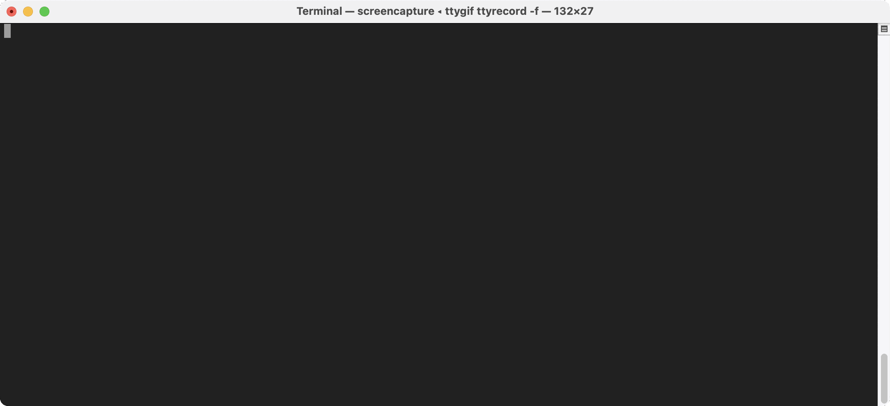

# Whitespace April Fool

The Whitespace programming language gained some notoriety when a [Slashdot article mentioned it](https://slashdot.org/story/03/04/01/0332202/new-whitespace-only-programming-language) on 1 Apr 2003. I wanted to revisit the language to celebrate the 21st birthday of its fame.

## Dependencies

You will need a whitespace interpreter. The original is still available online, courtesy of the [Wayback Machine](https://web.archive.org/web/20150717140342/http://compsoc.dur.ac.uk/whitespace/download.php), but it needs a couple of source tweaks to work with modern Haskell compilers. There's a patch file at [WSpace.patch](WSpace.patch); if you've downloaded and unpacked [v0.3](https://web.archive.org/web/20150717140342/http://compsoc.dur.ac.uk/whitespace/downloads/wspace-0.3.tgz), so you have `WSpace` in your current directory, patch it with `patch -p0 < WSpace.patch`; you should then be able to `cd WSpace; make`.

Alternatively, there's a long list of interpreters at <https://github.com/wspace/corpus>, many of which are written in languages that you'll likely already have installed on your machine. However, many of the interpreters I looked at were incorrect in various ways, e.g. getting the order of operands wrong for arithmetic operations; other programs on that list were libraries, but didn't provide a command-line interface. <https://github.com/kraterkraken/Whitespace> provides a `main()` that takes the name of a file to run.

## Source

The file [apr1.ws](apr1.ws) is, effectively, a "Hello world". However, the obvious way of writing a hello world in Whitespace is to push 72 (`H`) onto the stack, print the character with the ASCII code at the top of stack, then push 101 (`e`), print it, etc. This is what the Wikipedia example does. The code here uses more of the language features (addition, subtraction, multiplication, modulo, storing/retrieving from the heap, and looping), and (I assert) is more interesting as a result.

The file [apr1.c](apr1.c) is that same Whitespace source but *also* a valid C program that implements approximately the same operations to print approximately the same message.

## Screenshot

